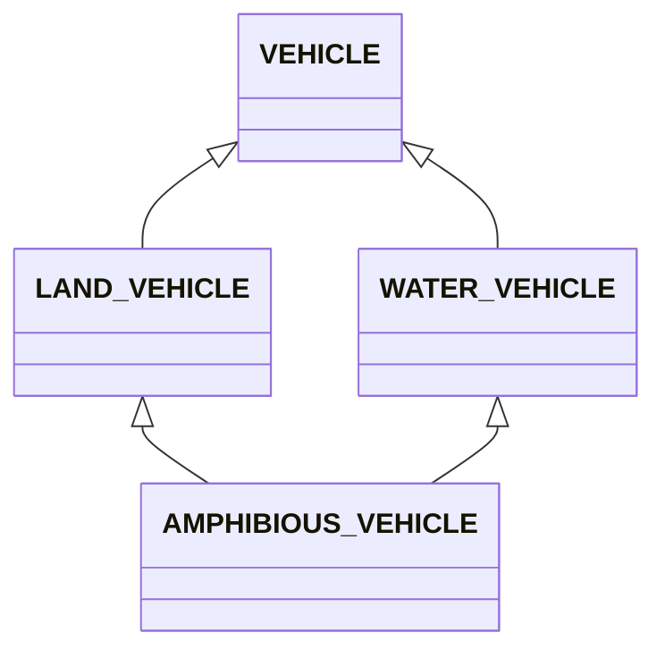

# 상속 (Inheritance)

> **2025년 업데이트** - EiffelStudio 25.02 기준

에펠은 **다중 상속**을 지원합니다. 하나의 클래스가 여러 클래스를 상속받을 수 있습니다.

---

## 기본 상속

### inherit 키워드

```eiffel
class
    CHILD_CLASS

inherit
    PARENT_CLASS

create
    make

feature
    -- 자식 클래스의 feature들
end
```

### 예제: 도형 계층

```eiffel
-- 부모 클래스
deferred class
    SHAPE

feature
    name: STRING
        deferred end

    area: REAL_64
        deferred end

    perimeter: REAL_64
        deferred end
end
```

```eiffel
-- 자식 클래스
class
    RECTANGLE

inherit
    SHAPE

create
    make

feature {NONE}
    make (w, h: REAL_64)
        do
            width := w
            height := h
        end

feature
    width: REAL_64
    height: REAL_64

    name: STRING = "Rectangle"

    area: REAL_64
        do
            Result := width * height
        end

    perimeter: REAL_64
        do
            Result := 2 * (width + height)
        end
end
```

---

## 추상 클래스 (Deferred Class)

`deferred class`는 인스턴스를 직접 생성할 수 없습니다.

```eiffel
deferred class
    ANIMAL

feature
    name: STRING
        deferred  -- 자식 클래스에서 구현
        end

    speak
        deferred  -- 자식 클래스에서 구현
        end

    sleep
        do
            print (name + " is sleeping...%N")
        end
end
```

```eiffel
class
    DOG

inherit
    ANIMAL

feature
    name: STRING = "Dog"

    speak
        do
            print ("Woof! Woof!%N")
        end
end
```

---

## Feature 재정의 (Redefine)

부모 클래스의 feature를 재정의하려면 `redefine` 절을 사용합니다.

```eiffel
class
    SPECIAL_RECTANGLE

inherit
    RECTANGLE
        redefine
            area  -- 재정의할 feature 선언
        end

create
    make

feature
    area: REAL_64
            -- 10% 할인된 면적 (특별한 사각형!)
        do
            Result := width * height * 0.9
        end
end
```

---

## Precursor (부모 호출)

재정의된 feature에서 부모 버전을 호출할 때 `Precursor`를 사용합니다.

```eiffel
class
    LOGGING_ACCOUNT

inherit
    BANK_ACCOUNT
        redefine
            deposit,
            withdraw
        end

create
    make

feature
    deposit (amount: INTEGER)
        do
            print ("Depositing: " + amount.out + "%N")
            Precursor (amount)  -- 부모의 deposit 호출
            print ("New balance: " + balance.out + "%N")
        end

    withdraw (amount: INTEGER)
        do
            print ("Withdrawing: " + amount.out + "%N")
            Precursor (amount)  -- 부모의 withdraw 호출
        end
end
```

---

## Feature 이름 변경 (Rename)

상속받은 feature의 이름을 변경할 수 있습니다.

```eiffel
class
    SQUARE

inherit
    RECTANGLE
        rename
            make as make_rectangle  -- 원래 make를 make_rectangle로 변경
        end

create
    make

feature
    make (side: REAL_64)
        do
            make_rectangle (side, side)  -- 변경된 이름으로 호출
        end
end
```

---

## 다중 상속

에펠은 여러 클래스를 동시에 상속받을 수 있습니다.

```eiffel
class
    AMPHIBIOUS_VEHICLE

inherit
    LAND_VEHICLE
        rename
            move as move_on_land
        end

    WATER_VEHICLE
        rename
            move as move_on_water
        end

create
    make

feature
    move (terrain: STRING)
        do
            if terrain ~ "land" then
                move_on_land
            else
                move_on_water
            end
        end
end
```

### 다이아몬드 문제 해결



에펠은 `rename`, `redefine`, `select` 등으로 충돌을 명시적으로 해결합니다.

```eiffel
class
    AMPHIBIOUS

inherit
    LAND_VEHICLE
        rename
            max_speed as land_max_speed
        select
            land_max_speed  -- 동적 바인딩에서 이것 사용
        end

    WATER_VEHICLE
        rename
            max_speed as water_max_speed
        end
end
```

---

## 상속 조정 절

| 절 | 용도 |
|-----|------|
| `rename` | feature 이름 변경 |
| `redefine` | feature 재정의 |
| `undefine` | feature를 다시 deferred로 |
| `select` | 다중 상속 충돌 해결 |
| `export` | 접근 권한 변경 |

### export 예제

```eiffel
inherit
    PARENT
        export
            {NONE} secret_feature  -- private으로 변경
            {ANY} hidden_feature   -- public으로 변경
        end
```

### undefine 예제

```eiffel
class
    ABSTRACT_CHILD

inherit
    CONCRETE_PARENT
        undefine
            some_feature  -- 다시 추상화
        end
end
```

---

## 다형성 (Polymorphism)

부모 타입 변수에 자식 객체를 할당할 수 있습니다.

```eiffel
local
    shapes: ARRAYED_LIST [SHAPE]
    rect: RECTANGLE
    circle: CIRCLE
do
    create shapes.make (10)
    create rect.make (10, 5)
    create circle.make (7)

    shapes.extend (rect)    -- RECTANGLE은 SHAPE
    shapes.extend (circle)  -- CIRCLE도 SHAPE

    -- 다형성: 실제 타입에 맞는 메서드 호출
    across shapes as cursor loop
        print (cursor.item.name + ": ")
        print ("Area = " + cursor.item.area.out + "%N")
    end
end
```

---

## 타입 검사와 캐스팅

### attached ... as (타입 캐스팅)

```eiffel
local
    shape: SHAPE
    rect: RECTANGLE
do
    create {RECTANGLE} shape.make (10, 5)

    -- 타입 검사 및 캐스팅
    if attached {RECTANGLE} shape as r then
        -- 이 블록에서 r은 RECTANGLE 타입
        print ("Width: " + r.width.out + "%N")
        print ("Height: " + r.height.out + "%N")
    end
end
```

### 동적 타입 생성

```eiffel
local
    shape: SHAPE
do
    -- 변수 타입은 SHAPE지만 실제 객체는 RECTANGLE
    create {RECTANGLE} shape.make (10, 5)

    print (shape.area.out)  -- RECTANGLE의 area 호출
end
```

---

## Expanded 클래스

일반적으로 에펠 객체는 참조(reference)입니다. `expanded` 클래스는 값(value) 타입입니다.

```eiffel
expanded class
    POINT

create
    make

feature
    x, y: REAL_64

    make (a_x, a_y: REAL_64)
        do
            x := a_x
            y := a_y
        end
end
```

```eiffel
local
    p1, p2: POINT  -- 스택에 할당, create 불필요
do
    p1.make (10, 20)
    p2 := p1  -- 값 복사 (참조 공유 아님)
end
```

---

## Frozen 클래스와 Feature

`frozen`은 상속이나 재정의를 금지합니다.

```eiffel
-- 상속 금지 클래스
frozen class
    IMMUTABLE_CONFIG

feature
    api_key: STRING

    frozen validate
            -- 이 feature는 재정의 불가
        do
            -- 검증 로직
        end
end
```

```eiffel
class
    CHILD

inherit
    PARENT
        redefine
            normal_feature  -- OK
            -- frozen_feature  -- 컴파일 오류!
        end
end
```

---

## Non-Conforming 상속

EiffelStudio에서는 **비순응 상속(non-conforming inheritance)**을 지원합니다. 이는 구현만 상속하고 타입 관계는 맺지 않습니다.

```eiffel
class
    UTILITY_USER

inherit {NONE}  -- 비순응 상속: 구현만 가져옴
    STRING_UTILITIES
        export
            {NONE} all
        end

feature
    process (s: STRING)
        do
            -- STRING_UTILITIES의 feature 사용 가능
            -- 하지만 UTILITY_USER는 STRING_UTILITIES 타입이 아님
        end
end
```

| 상속 유형 | 선언 | 타입 관계 | 구현 상속 |
|----------|------|----------|----------|
| 일반(순응) | `inherit A` | O | O |
| 비순응 | `inherit {NONE} A` | X | O |

---

## 상속 vs 구성 (Composition)

에펠에서도 "상속보다 구성을 선호하라"는 원칙이 적용됩니다.

```eiffel
-- 상속 사용 (is-a 관계)
class MANAGER inherit EMPLOYEE end

-- 구성 사용 (has-a 관계)
class TEAM
feature
    manager: MANAGER
    members: ARRAYED_LIST [EMPLOYEE]
end
```

| 상황 | 권장 방식 |
|------|----------|
| is-a 관계 (Manager는 Employee이다) | 상속 |
| has-a 관계 (Team은 Manager를 가진다) | 구성 |
| 구현만 재사용 | 비순응 상속 또는 구성 |
| 다형성이 필요한 경우 | 상속 |

---

## 연습 문제

1. `VEHICLE` 계층 구조를 만드세요 (Car, Motorcycle, Bicycle).
2. `EMPLOYEE` 클래스와 `MANAGER`, `DEVELOPER` 자식 클래스를 만드세요.
3. 다중 상속을 사용하여 `FLYING_CAR` 클래스를 만드세요.

---

## 참고 자료

- [Eiffel Inheritance](https://www.eiffel.org/doc/eiffel/Inheritance)
- [Multiple Inheritance](https://www.eiffel.org/doc/eiffel/Multiple_inheritance)
- [Non-conforming Inheritance](https://www.eiffel.org/doc/eiffel/Non-conforming_inheritance)

---

## 다음 단계

[06_Design_by_Contract.md](../06_design_by_contract/06_Design_by_Contract.md)에서 에펠의 핵심인 계약 기반 설계를 학습합니다.
