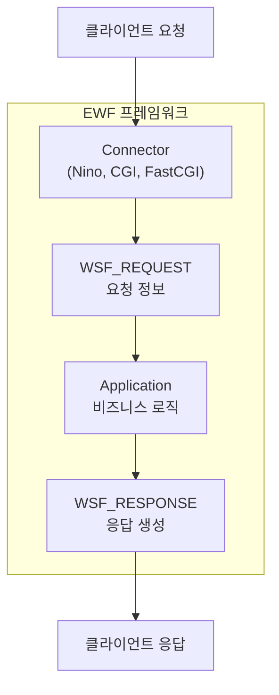

# EWF 웹 서버

> **2025년 업데이트** - EiffelStudio 25.02 기준

**EWF (Eiffel Web Framework)**는 에펠로 웹 애플리케이션을 개발하기 위한 프레임워크입니다.

---

## EWF 개요

### 주요 특징

- **플랫폼 독립적**: Windows, Linux, macOS 지원
- **다양한 커넥터**: Standalone, CGI, FastCGI
- **라우터 지원**: URL 패턴 매칭
- **미들웨어**: 요청/응답 처리 파이프라인

### 아키텍처



---

## 프로젝트 설정

### ECF 파일

```xml
<?xml version="1.0" encoding="ISO-8859-1"?>
<system name="web_server" uuid="...">
    <target name="web_server">
        <root class="APPLICATION" feature="make_and_launch"/>

        <!-- 기본 라이브러리 -->
        <library name="base"
            location="$ISE_LIBRARY\library\base\base.ecf"/>

        <!-- EWF 라이브러리 -->
        <library name="wsf"
            location="$ISE_LIBRARY\contrib\library\web\framework\ewf\wsf\wsf.ecf"/>

        <!-- Nino 독립 실행형 서버 -->
        <library name="wsf_nino"
            location="$ISE_LIBRARY\contrib\library\web\framework\ewf\wsf\connector\nino\wsf_nino.ecf"/>

        <cluster name="src" location=".\"/>
    </target>
</system>
```

---

## Hello World 서버

### 최소 구현

```eiffel
class
    APPLICATION

inherit
    WSF_DEFAULT_SERVICE
        redefine
            initialize
        end

create
    make_and_launch

feature {NONE} -- Initialization

    make_and_launch
        do
            print ("서버 시작: http://localhost:9090%N")
            make_and_launch_nino
        end

    initialize
        do
            Precursor
            set_service_option ("port", 9090)
        end

feature -- Execution

    execute (req: WSF_REQUEST; res: WSF_RESPONSE)
        do
            res.set_status_code (200)
            res.header.put_content_type_text_html
            res.put_string ("<h1>Hello, Eiffel!</h1>")
        end

end
```

### 실행 방법

1. EiffelStudio에서 컴파일 (F7)
2. 실행 (Ctrl+F5)
3. 브라우저에서 `http://localhost:9090` 접속

---

## 핵심 클래스

### WSF_REQUEST

HTTP 요청 정보를 담고 있습니다.

```eiffel
execute (req: WSF_REQUEST; res: WSF_RESPONSE)
    local
        method: STRING
        path: STRING
        param: detachable STRING
    do
        -- HTTP 메서드
        method := req.request_method  -- "GET", "POST", etc.

        -- 요청 경로
        path := req.path_info  -- "/api/users"

        -- 쿼리 파라미터
        param := req.query_parameter ("id")
        if attached param as id then
            print ("ID: " + id + "%N")
        end

        -- POST 데이터
        if attached req.form_parameter ("name") as name then
            print ("Name: " + name + "%N")
        end
    end
```

### WSF_RESPONSE

HTTP 응답을 생성합니다.

```eiffel
execute (req: WSF_REQUEST; res: WSF_RESPONSE)
    local
        html: STRING
    do
        -- 상태 코드
        res.set_status_code (200)  -- OK
        -- res.set_status_code (404)  -- Not Found
        -- res.set_status_code (500)  -- Server Error

        -- Content-Type 설정
        res.header.put_content_type_text_html
        -- res.header.put_content_type ("application/json")

        -- 본문 작성
        html := "<html><body><h1>Hello!</h1></body></html>"
        res.header.put_content_length (html.count)
        res.put_string (html)
    end
```

---

## 라우팅

### 수동 라우팅

```eiffel
execute (req: WSF_REQUEST; res: WSF_RESPONSE)
    local
        path: STRING
    do
        path := req.path_info

        if path.is_equal ("/") then
            handle_home (req, res)
        elseif path.is_equal ("/about") then
            handle_about (req, res)
        elseif path.starts_with ("/api/") then
            handle_api (req, res)
        else
            handle_not_found (req, res)
        end
    end

feature -- Handlers

    handle_home (req: WSF_REQUEST; res: WSF_RESPONSE)
        do
            res.set_status_code (200)
            res.header.put_content_type_text_html
            res.put_string ("<h1>홈페이지</h1>")
        end

    handle_not_found (req: WSF_REQUEST; res: WSF_RESPONSE)
        do
            res.set_status_code (404)
            res.header.put_content_type_text_html
            res.put_string ("<h1>404 - Not Found</h1>")
        end
```

### URL 파라미터 추출

```eiffel
-- /users/123 형태 처리
handle_user (req: WSF_REQUEST; res: WSF_RESPONSE)
    local
        path: STRING
        user_id: STRING
    do
        path := req.path_info
        -- "/users/123" -> "123"
        if path.count > 7 then
            user_id := path.substring (8, path.count)
            res.put_string ("User ID: " + user_id)
        end
    end
```

---

## JSON 응답

### 간단한 JSON 응답

```eiffel
handle_api_data (req: WSF_REQUEST; res: WSF_RESPONSE)
    local
        json: STRING
    do
        json := "{%"status%": %"success%", %"count%": 42}"

        res.set_status_code (200)
        res.header.put_content_type ("application/json")
        res.header.put_content_length (json.count)
        res.put_string (json)
    end
```

### JSON 라이브러리 사용

ECF에 JSON 라이브러리 추가:

```xml
<library name="json"
    location="$ISE_LIBRARY\contrib\library\text\parser\json\library\json.ecf"/>
```

```eiffel
handle_api_users (req: WSF_REQUEST; res: WSF_RESPONSE)
    local
        json_obj: JSON_OBJECT
        json_arr: JSON_ARRAY
        user: JSON_OBJECT
    do
        create json_obj.make
        create json_arr.make (2)

        -- 첫 번째 사용자
        create user.make
        user.put_string ("Alice", "name")
        user.put_integer (25, "age")
        json_arr.extend (user)

        -- 두 번째 사용자
        create user.make
        user.put_string ("Bob", "name")
        user.put_integer (30, "age")
        json_arr.extend (user)

        json_obj.put (json_arr, "users")
        json_obj.put_integer (2, "total")

        res.set_status_code (200)
        res.header.put_content_type ("application/json")
        res.put_string (json_obj.representation)
    end
```

출력:

```json
{
    "users": [
        {"name": "Alice", "age": 25},
        {"name": "Bob", "age": 30}
    ],
    "total": 2
}
```

---

## HTML 템플릿

### Verbatim 문자열 사용

```eiffel
home_page (title: STRING; content: STRING): STRING
    do
        Result := "[
<!DOCTYPE html>
<html>
<head>
    <meta charset="UTF-8">
    <title>]" + title + "[</title>
    <style>
        body { font-family: sans-serif; margin: 40px; }
    </style>
</head>
<body>
    ]" + content + "[
</body>
</html>
        ]"
    end
```

---

## 미들웨어 패턴

요청 전/후 처리를 위한 패턴:

```eiffel
execute (req: WSF_REQUEST; res: WSF_RESPONSE)
    do
        -- 전처리: 로깅
        log_request (req)

        -- 전처리: 인증
        if not is_authenticated (req) then
            res.set_status_code (401)
            res.put_string ("Unauthorized")
        else
            -- 실제 처리
            handle_request (req, res)
        end

        -- 후처리: 로깅
        log_response (res)
    end

feature {NONE} -- Middleware

    log_request (req: WSF_REQUEST)
        do
            print ("[" + current_time + "] ")
            print (req.request_method + " " + req.path_info + "%N")
        end

    is_authenticated (req: WSF_REQUEST): BOOLEAN
        do
            -- 인증 토큰 확인
            Result := attached req.http_authorization as auth
                and then auth.starts_with ("Bearer ")
        end
```

---

## 정적 파일 서빙

```eiffel
handle_static (req: WSF_REQUEST; res: WSF_RESPONSE)
    local
        file_path: STRING
        file: RAW_FILE
        content: STRING
    do
        -- /static/style.css -> ./public/style.css
        file_path := "public" + req.path_info.substring (8, req.path_info.count)

        create file.make_with_name (file_path)
        if file.exists and file.is_readable then
            file.open_read
            file.read_stream (file.count)
            content := file.last_string
            file.close

            res.set_status_code (200)
            set_content_type_by_extension (res, file_path)
            res.put_string (content)
        else
            res.set_status_code (404)
            res.put_string ("File not found")
        end
    end

set_content_type_by_extension (res: WSF_RESPONSE; path: STRING)
    do
        if path.ends_with (".css") then
            res.header.put_content_type ("text/css")
        elseif path.ends_with (".js") then
            res.header.put_content_type ("application/javascript")
        elseif path.ends_with (".png") then
            res.header.put_content_type ("image/png")
        else
            res.header.put_content_type ("text/plain")
        end
    end
```

---

## 서버 설정

### 포트 변경

```eiffel
initialize
    do
        Precursor
        set_service_option ("port", 8080)
    end
```

### INI 파일 사용

**server.ini**:

```ini
[server]
port=9090
max_concurrent_connections=100
```

```eiffel
initialize
    do
        Precursor
        create {WSF_SERVICE_LAUNCHER_OPTIONS_FROM_INI}
            service_options.make_from_file ("server.ini")
    end
```

---

## 배포

### 독립 실행형 (Nino)

```bash
# 컴파일
ec -config web_server.ecf -finalize

# 실행
./EIFGENs/web_server/F_code/web_server
```

### CGI/FastCGI

ECF에서 다른 커넥터 사용:

```xml
<!-- CGI -->
<library name="wsf_cgi"
    location="$ISE_LIBRARY\contrib\library\web\framework\ewf\wsf\connector\cgi\wsf_cgi.ecf"/>

<!-- FastCGI -->
<library name="wsf_libfcgi"
    location="$ISE_LIBRARY\contrib\library\web\framework\ewf\wsf\connector\libfcgi\wsf_libfcgi.ecf"/>
```

---

## 완전한 예제

프로젝트의 `07_web_server` 폴더에 있는 `application.e`를 참조하세요.

기능:

- `/` - 홈페이지
- `/about` - 소개 페이지
- `/greet/{name}` - 동적 인사
- `/api/hello` - JSON API

---

## 참고 자료

- [EWF GitHub](https://github.com/EiffelWebFramework/EWF)
- [EWF 문서](https://github.com/EiffelWebFramework/EWF/tree/master/doc)
- [EWF 예제](https://github.com/EiffelWebFramework/EWF/tree/master/examples)

---

## EiffelStudio 25.02의 새 기능

### MongoDB/MariaDB 지원

EiffelStudio 25.02에서는 새로운 데이터베이스 라이브러리가 추가되었습니다:

```xml
<!-- MongoDB 지원 -->
<library name="mongodb"
    location="$ISE_LIBRARY\contrib\library\database\mongodb\mongodb.ecf"/>

<!-- MariaDB 지원 -->
<library name="mariadb"
    location="$ISE_LIBRARY\contrib\library\database\mariadb\mariadb.ecf"/>
```

---

## 보안 고려사항

웹 애플리케이션 개발 시 주의할 보안 사항:

```eiffel
handle_user_input (req: WSF_REQUEST; res: WSF_RESPONSE)
    local
        user_input: detachable STRING
    do
        -- XSS 방지: 사용자 입력 이스케이프
        user_input := req.query_parameter ("name")
        if attached user_input as input then
            -- HTML 특수 문자 이스케이프
            input := escape_html (input)
        end
    end

escape_html (s: STRING): STRING
        -- HTML 특수 문자 이스케이프
    do
        Result := s.twin
        Result.replace_substring_all ("&", "&amp;")
        Result.replace_substring_all ("<", "&lt;")
        Result.replace_substring_all (">", "&gt;")
        Result.replace_substring_all ("%"", "&quot;")
    end
```

---

## 다음 단계

축하합니다! 에펠 기초 과정을 완료했습니다.

### 추가 학습 주제

| 주제 | 설명 |
|------|------|
| **데이터베이스** | MongoDB, MariaDB, ODBC 연동 |
| **RESTful API** | WSF_ROUTER를 사용한 REST 설계 |
| **웹소켓** | EWF 웹소켓 지원 |
| **테스팅** | EiffelTest, AutoTest |
| **에이전트** | 함수/프로시저 객체화 |
| **SCOOP** | 동시성 프로그래밍 |

### 참고 자료

- [EWF GitHub](https://github.com/EiffelWebFramework/EWF)
- [EWF 문서](https://github.com/EiffelWebFramework/EWF/tree/master/doc)
- [EiffelStudio 25.02 릴리스 노트](https://www.eiffel.com/2025/eiffelstudio-25-02/)
- [Eiffel 공식 문서](https://www.eiffel.org/documentation)
