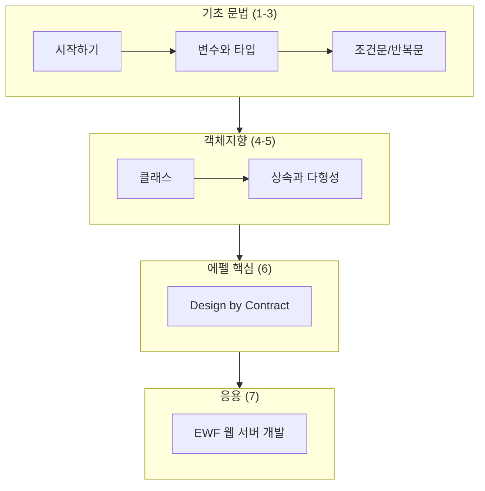

# 에펠(Eiffel) 프로그래밍 튜토리얼

> **2025년 업데이트** - EiffelStudio 25.02 기준

에펠 프로그래밍 언어를 기초부터 웹 서버 개발까지 배우는 종합 가이드입니다.

---

## 목차

| # | 주제 | 설명 | 디렉토리 |
|---|------|------|----------|
| 1 | [시작하기](01_hello_world/01_시작하기.md) | 에펠 소개, 환경 설정, Hello World | `01_hello_world/` |
| 2 | [변수와 타입](02_variables_types/02_변수와_타입.md) | 기본 타입, 변수, Void 안전성, 튜플 | `02_variables_types/` |
| 3 | [조건문과 반복문](03_conditionals_loops/03_조건문과_반복문.md) | if, inspect, loop, across, 양화사 | `03_conditionals_loops/` |
| 4 | [클래스](04_classes/04_클래스.md) | 클래스 정의, feature, 생성자, 에이전트 | `04_classes/` |
| 5 | [상속](05_inheritance/05_상속.md) | 상속, 다형성, 다중 상속, frozen | `05_inheritance/` |
| 6 | [Design by Contract](06_design_by_contract/06_Design_by_Contract.md) | require, ensure, invariant, AutoTest | `06_design_by_contract/` |
| 7 | [웹 서버](07_web_server/07_웹서버.md) | EWF 프레임워크, REST API | `07_web_server/` |

---

## 빠른 시작

### 1. EiffelStudio 25.02 설치

[EiffelStudio 다운로드](https://www.eiffel.com/eiffelstudio/)에서 **Community Edition**(무료, 오픈소스)을 다운로드하세요.

**EiffelStudio 25.02 새 기능 (2025년 2월):**

- SVG 다이어그램 내보내기
- MongoDB/MariaDB 라이브러리
- EIFDATA 디렉토리 중앙 관리
- 크로스 플랫폼 개선

### 2. 첫 프로그램 실행

```eiffel
class HELLO
create make
feature
    make
        do
            print ("Hello, Eiffel!%N")
            print ("EiffelStudio 25.02에서 실행 중!%N")
        end
end
```

### 3. 컴파일 및 실행

| 단축키 | 동작 |
|--------|------|
| **F7** | 컴파일 |
| **Ctrl+F5** | 실행 |
| **F5** | 디버그 실행 |

---

## 에펠의 특징

| 특징 | 설명 |
|------|------|
| **Design by Contract** | 사전조건(require), 사후조건(ensure), 불변식(invariant) |
| **순수 객체지향** | 모든 코드가 클래스 안에 존재 |
| **다중 상속** | rename, redefine, select로 충돌 해결 |
| **Void 안전성** | attached/detachable 타입으로 null 참조 방지 |
| **자동 메모리 관리** | 가비지 컬렉션 내장 |
| **SCOOP** | 간단한 동시성 객체지향 프로그래밍 |
| **ISO/ECMA 표준** | ECMA-367, ISO/IEC 25436 국제 표준 |

---

## 문법 빠른 참조

### 변수와 할당

```eiffel
local
    name: STRING           -- 변수 선언
    age: INTEGER
    data: detachable DATA  -- Void 가능
do
    name := "Eiffel"       -- 할당 (:= 사용!)
    age := 25
end
```

### 조건문

```eiffel
if condition then
    -- ...
elseif other then
    -- ...
else
    -- ...
end

-- inspect (switch/case)
inspect value
when 1 then ...
when 2, 3 then ...
else ...
end
```

### 반복문

```eiffel
-- from-until (until이 True가 되면 종료!)
from i := 1 until i > 10 loop
    print (i)
    i := i + 1
end

-- across (컬렉션 순회)
across list as cursor loop
    print (cursor.item)
end

-- 양화사 (all/some)
all_positive := across list as c all c.item > 0 end
has_zero := across list as c some c.item = 0 end
```

### 클래스

```eiffel
class MY_CLASS
inherit
    PARENT_CLASS
        redefine some_feature end
create
    make
feature {NONE} -- Initialization
    make do ... end
feature -- Access
    my_attribute: TYPE
feature -- Query (상태 변경 없음)
    my_query: TYPE do Result := ... end
feature -- Command (상태 변경)
    my_command do ... end
invariant
    always_true: condition
end
```

### Design by Contract

```eiffel
deposit (amount: INTEGER)
    require
        positive: amount > 0
    do
        balance := balance + amount
    ensure
        increased: balance = old balance + amount
    end

invariant
    non_negative: balance >= 0
end
```

---

## 프로젝트 구조

```text
eiffel-tutorial/
├── README.md                    # 이 파일
├── 01_hello_world/              # Hello World
│   ├── 01_시작하기.md
│   ├── hello.e
│   └── hello.ecf
├── 02_variables_types/          # 변수와 타입
│   ├── 02_변수와_타입.md
│   ├── variables.e
│   └── variables.ecf
├── 03_conditionals_loops/       # 제어 구조
│   ├── 03_조건문과_반복문.md
│   ├── control_flow.e
│   └── control_flow.ecf
├── 04_classes/                  # 클래스
│   ├── 04_클래스.md
│   ├── person.e, main.e
│   └── classes.ecf
├── 05_inheritance/              # 상속
│   ├── 05_상속.md
│   ├── shape.e, rectangle.e, ...
│   └── inheritance.ecf
├── 06_design_by_contract/       # Design by Contract
│   ├── 06_Design_by_Contract.md
│   ├── bank_account.e, stack.e, ...
│   └── dbc.ecf
└── 07_web_server/               # EWF 웹 서버
    ├── 07_웹서버.md
    ├── application.e
    └── web_server.ecf
```

각 폴더에는 `.e` 소스 파일과 `.ecf` 프로젝트 파일이 있습니다.

---

## 학습 경로



순서대로 학습하는 것을 권장합니다.

---

## 에펠 vs 다른 언어

| 개념 | Java/C# | Python | Eiffel |
|------|---------|--------|--------|
| 할당 | `=` | `=` | `:=` |
| 비교 | `==` | `==` | `=` |
| 불일치 | `!=` | `!=` | `/=` |
| 반환 | `return x` | `return x` | `Result := x` |
| null | `null` | `None` | `Void` |
| this | `this` | `self` | `Current` |
| 블록 종료 | `}` | 들여쓰기 | `end` |
| 줄바꿈 | `\n` | `\n` | `%N` |

---

## 참고 자료

### 공식 자료

- [Eiffel.org](https://www.eiffel.org/) - 공식 사이트
- [EiffelStudio](https://www.eiffel.com/eiffelstudio/) - IDE 다운로드
- [공식 튜토리얼](https://www.eiffel.org/doc/eiffel/An_Eiffel_Tutorial_(ET))

### EiffelStudio 릴리스

- [EiffelStudio 25.02](https://www.eiffel.com/2025/eiffelstudio-25-02/) - 최신 버전
- [EiffelStudio 24.05](https://www.eiffel.com/2024/eiffelstudio-24-05/) - .NET 8.0 지원

### Design by Contract

- [DbC 소개](https://www.eiffel.com/values/design-by-contract/introduction/)
- [Object-Oriented Software Construction (책)](https://www.eiffel.com/resources/books/)

### 웹 개발

- [EWF GitHub](https://github.com/EiffelWebFramework/EWF)
- [EWF 문서](https://github.com/EiffelWebFramework/EWF/tree/master/doc)

### 커뮤니티

- [Eiffel Users Group](https://groups.google.com/g/eiffel-users)
- [GitHub - EiffelStudio](https://github.com/EiffelSoftware/EiffelStudio)
- [Awesome Eiffel](https://github.com/seamus-brady/awesome-eiffel)

---

## 라이선스

이 튜토리얼은 학습 목적으로 자유롭게 사용할 수 있습니다.

---

즐거운 에펠 프로그래밍 되세요! 🗼
